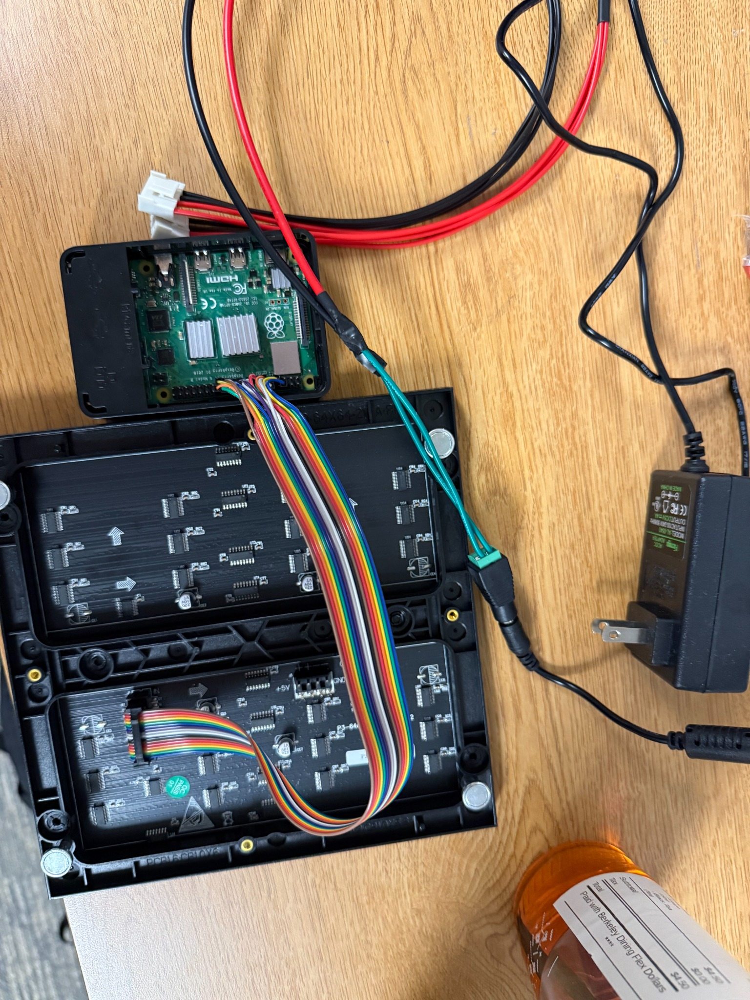

# RGB Matrix Music Visualizer

A real-time music visualizer running on a Raspberry Pi and a 64×64 HUB75 RGB LED matrix.

The program captures microphone input, applies a Fast Fourier Transform (FFT), groups the resulting frequencies into logarithmically spaced bands, and renders animated rainbow bars that react to the music.

**[Watch the demo video](https://drive.google.com/file/d/1t191fsDHJIpErmzPbE6yGSkyN_oB7htx/edit)**



## Features

- Real-time microphone input
- FFT-based frequency analysis
- Logarithmically spaced frequency bands
- Per-band treble boosting
- Adjustable gain and smoothing
- Rainbow HSV color mapping
- VSync canvas swapping to reduce flicker
- Debug logging for audio and rendering behavior

## How It Works

### 1. Capture audio

Audio is recorded from a microphone with `pyaudio` at 44,100 samples per second.

Each frame contains 2,048 signed 16-bit samples, which are converted into NumPy values for analysis:

```python
samples = np.frombuffer(raw, dtype=np.int16).astype(np.float32)
```

### 2. Transform audio into frequency data

A real-valued Fast Fourier Transform converts the time-domain samples into frequency-domain data:

```python
fft = np.fft.rfft(samples)
magnitude = np.abs(fft)
```

With a chunk size of `2048`, `rfft()` returns `1025` frequency bins.

The frequency resolution is:

```text
44,100 / 2,048 ≈ 21.5 Hz per bin
```

A bin's approximate frequency is:

```text
frequency = bin_index × 21.5 Hz
```

### 3. Group bins into visual bars

The FFT bins are divided into logarithmically spaced frequency ranges between approximately 200 Hz and 16,000 Hz.

Logarithmic spacing better matches how humans perceive pitch and gives the lower, middle, and higher frequencies a more balanced visual representation.

```text
Linear spacing:
many low-frequency octaves are compressed into the first few bars

Log spacing:
each bar covers a more perceptually balanced frequency range
```

For each frequency range, the strongest FFT magnitude is used as that bar's value:

```python
bar_value = np.max(magnitude[start_bin:end_bin])
```

### 4. Normalize and boost

Each bar is normalized into a usable display range:

```python
normalized = bar_value / FFT_SCALE
```

Higher-frequency bands are boosted because treble usually contains less energy than bass:

```text
low frequencies  → smaller boost
mid frequencies  → moderate boost
high frequencies → larger boost
```

### 5. Render the matrix

Each frequency band becomes a vertical bar on the LED matrix.

- Height is based on normalized magnitude and gain
- Color is based on horizontal position
- HSV color conversion creates a rainbow across the panel
- Double-buffered canvas swapping prevents visible flicker

```text
bass   → red/orange
mids   → green/cyan
treble → blue/purple
```

## Hardware

| Component | Details |
|---|---|
| Raspberry Pi | Raspberry Pi 4 used; 3B+ or newer recommended |
| LED matrix | 64×64 HUB75 RGB panel |
| Audio input | USB microphone or another supported input device |
| Power | External power supply for the matrix |
| Connection | HUB75 ribbon cable and Raspberry Pi GPIO adapter |

## Wiring

The Raspberry Pi controls the HUB75 panel through its GPIO pins while the matrix receives power from a separate supply.


> The LED matrix should not be powered directly from the Raspberry Pi's 5V pin. Use a suitable external power supply and connect grounds correctly.

## Installation

### System dependencies

```bash
sudo apt update
sudo apt install python3-pyaudio portaudio19-dev
```

### Python dependencies

```bash
pip3 install numpy
```

### RGB matrix library

Install the `rpi-rgb-led-matrix` project and its Python bindings:

https://github.com/hzeller/rpi-rgb-led-matrix

## Usage

```bash
sudo python3 music_visualizer.py
```

Press `Q` or `Escape` to quit.

## Configuration

The main tuning values are defined near the top of `music_visualizer.py`.

| Variable | Default | Effect |
|---|---:|---|
| `SAMPLE_RATE` | `44100` | Audio samples captured per second |
| `CHUNK` | `2048` | Samples per frame; larger values improve frequency resolution but add latency |
| `NUM_BARS` | `32` | Number of displayed frequency bands |
| `SMOOTHING` | `0.6` | Controls how quickly bars fall |
| `GAIN` | `2.0` | Multiplies the displayed bar height |
| `FFT_SCALE` | `600000.0` | Normalization reference for FFT magnitudes |
| `MIN_FREQ` | `200` | Lowest displayed frequency |
| `MAX_FREQ` | `16000` | Highest displayed frequency |

## Debugging

Debug output is written to:

```text
debug.log
```

Watch it live:

```bash
tail -f debug.log
```

Common tuning issues:

| Problem | Adjustment |
|---|---|
| Bars stay too short | Increase `GAIN` or lower `FFT_SCALE` |
| Bars constantly hit the top | Lower `GAIN` or increase `FFT_SCALE` |
| Motion feels too slow | Lower `SMOOTHING` |
| Motion feels too jittery | Increase `SMOOTHING` |
| Treble barely moves | Increase the high-frequency boost |
| Audio input fails | Check the selected PyAudio device |

## Project Structure

```text
rgb-matrix-music-visualizer/
├── music_visualizer.py
├── README.md
├── debug.log
└── docs/
    └── rgb-matrix-wiring.jpeg
```

## What I Learned

- Capturing and processing live audio
- Converting time-domain audio into frequency-domain data
- Interpreting FFT bins and frequency resolution
- Designing logarithmic frequency buckets
- Normalizing and smoothing noisy real-time signals
- Mapping numerical data to LED animations
- Driving a HUB75 matrix from Raspberry Pi GPIO
- Debugging audio, hardware, and timing issues together

## Future Improvements

- Add multiple visualization modes
- Add automatic gain control
- Add beat detection
- Add color palette selection
- Add a browser-based configuration panel
- Add saved presets for different microphones and room environments
